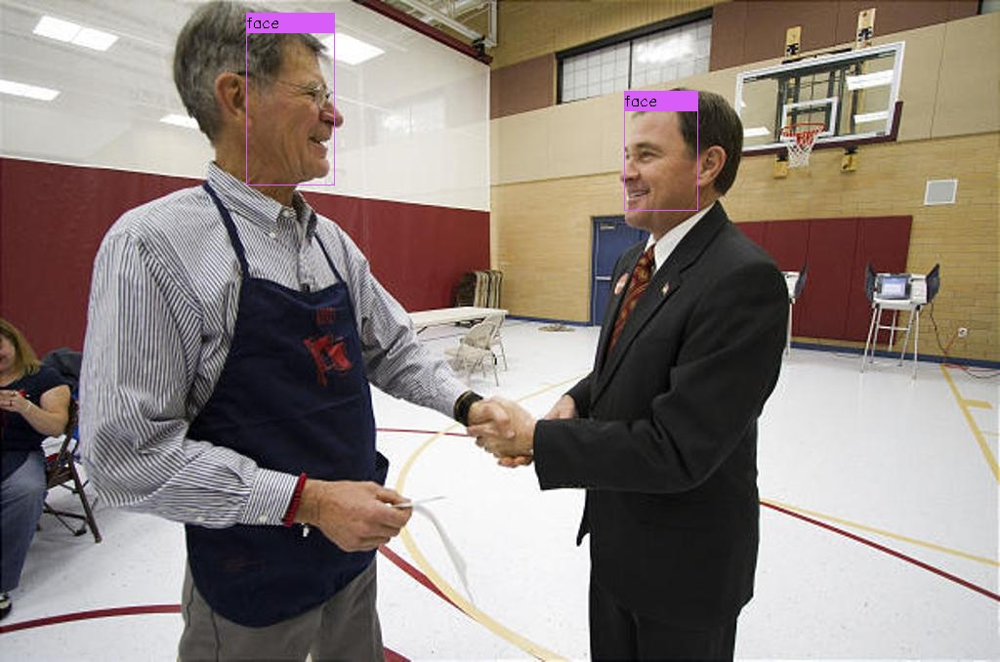
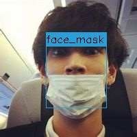

# FPGA Yolov2 Mask detection
基于FPGA量化的人脸口罩检测

主框架使用：https://github.com/yjh0410/yolov2-yolov3_PyTorch

添加bn融合以及FPGA量化部分,并设计实际使用的网络结构slim_yolov2

数据集使用：https://github.com/AIZOOTech/FaceMaskDetection 内的人脸口罩数据集，转成VOC格式后使用

# Installation Dependencies:
- python3
- pytorch
- pycocotools
- numpy
- opencv

# Dataset
将数据集软连接到该文件夹的dataset下

example: 
```Shell
ln -s /data/coco dataset/coco
        
ln -s /data/VOC dataset/VOC
```
# Visualization





# Train
在此只展示训练口罩检测时用的代码，其余command可以从https://github.com/yjh0410/yolov2-yolov3_PyTorch 中自行查找
## VOC
泛用用例：
```Shell
python train.py -d dataset --cuda -v [select a model] -hr -ms
```
训练FP32模型：
```Shell
python train.py -d mask --cuda -v slim_yolo_v2
```
BN融合：
```Shell
python conv+bn2conv.py -d mask --cuda -v slim_yolo_v2 -r your_weight_path
```
BN融合后微调精度：
```Shell
python retune_bias_quantize.py -d mask --cuda -v slim_yolo_v2_q_bf -r your_weight_path
```
FPGA模拟量化：
```Shell
python retune_bias_quantize.py -d mask --cuda -v slim_yolo_v2_q_bf -q -r your_weight_path
```
寻找FPGA定点计算时防止溢出而加上的每层的scale_retune：
```Shell
python retune_bias_quantize_findbest.py -d mask --cuda -v slim_yolo_v2_q_bf -q -r your_weight_path
```

You can run ```python train.py -h``` to check all optional argument.
.
# test
## VOC
```Shell
python test.py -v slim_yolo_v2_q_bf -d mask --cuda --trained_model your_weight_path 
```
# Detection
```Shell
python demo.py -v slim_yolo_v2_q_bf --mode camera --trained_model your_weight_path
```
